# Process Swarm Data Dictionary & Entity Relationship Diagram

**Last Updated:** 2026-03-19
**Database Engine:** SQLite 3 (platform.db)
**Frontend Storage:** None (ProofUI is stateless — no localStorage, sessionStorage, or cookies)

---

## Storage Architecture

```
Process Swarm Data Stores
├── SQLite Database (platform.db)         ← 30 tables, all relational state
├── Workspace Files (workspace/run-*)     ← per-run artifacts, traces, reports
│   ├── artifacts/run_manifest.json       ← run metadata
│   ├── inference_trace.json              ← engine/model/latency per pipeline stage
│   ├── *_output.json                     ← stage outputs (extraction, clustering, etc.)
│   └── output/                           ← final deliverables (reports, audio)
├── ARGUS-Hold Ledger (JSONL)             ← append-only hash-chained execution log
└── ACDS PostgreSQL (optional)            ← provider registry, execution records, audit
```

**ProofUI has zero client-side persistence.** All state is fetched from the SQLite database and workspace files via REST API on every page load. No localStorage, sessionStorage, or cookies are used.

---

## Entity Relationship Diagram

```mermaid
erDiagram
    %% ══════════════════════════════════════════
    %% CORE ENTITIES
    %% ══════════════════════════════════════════

    swarms ||--o{ intent_drafts : "has drafts"
    swarms ||--o{ behavior_sequences : "has sequences"
    swarms ||--o{ swarm_schedules : "has schedules"
    swarms ||--o{ swarm_deliveries : "has deliveries"
    swarms ||--o{ swarm_runs : "has runs"
    swarms ||--o{ swarm_events : "logs events"
    swarms ||--o{ swarm_actions : "defines actions"
    swarms ||--o{ action_table_acceptances : "tracks acceptances"
    swarms ||--o{ governance_warning_records : "governance warnings"
    swarms ||--o{ intent_clarifications : "clarifications"
    swarms ||--o{ action_tables : "action tables"

    %% ══════════════════════════════════════════
    %% INTENT PIPELINE
    %% ══════════════════════════════════════════

    intent_drafts ||--o{ intent_restatements : "restated as"
    intent_drafts ||--o{ intent_archetypes : "classified as"
    intent_drafts ||--o{ constraint_sets : "has constraints"
    intent_drafts ||--o{ intent_clarifications : "needs clarification"

    intent_restatements ||--o{ intent_acceptances : "accepted via"
    intent_restatements ||--o{ intent_clarifications : "clarified by"

    intent_acceptances ||--o{ action_tables : "produces"

    %% ══════════════════════════════════════════
    %% ACTION PIPELINE
    %% ══════════════════════════════════════════

    swarm_actions ||--o{ swarm_action_dependencies : "depends on"
    swarm_actions ||--o{ action_tool_readiness : "tool readiness"
    swarm_actions ||--o{ proposed_tools : "proposes tools"
    swarm_actions ||--o{ run_action_results : "produces results"

    action_tables ||--o{ archetype_classifications : "classified"
    action_tables ||--o{ tool_match_sets : "matched tools"

    %% ══════════════════════════════════════════
    %% TOOL REGISTRY
    %% ══════════════════════════════════════════

    tool_registry ||--o{ action_tool_readiness : "assessed for"
    tool_registry ||--o{ tool_scope_rules : "scoped by"
    tool_registry ||--o{ tool_capability_family_bindings : "bound to families"
    tool_registry ||--o{ run_action_results : "executed as"

    capability_families ||--o{ tool_capability_family_bindings : "contains tools"

    %% ══════════════════════════════════════════
    %% EXECUTION & DELIVERY
    %% ══════════════════════════════════════════

    swarm_runs ||--o{ run_action_results : "has results"
    swarm_runs ||--o{ delivery_receipts : "delivered via"
    swarm_runs ||--o{ governance_warning_records : "warnings"
    swarm_runs ||--o{ reduced_assurance_governance_events : "reduced assurance"

    swarm_deliveries ||--o{ delivery_receipts : "receipts"
    recipient_profiles ||--o{ swarm_deliveries : "delivers to"

    governance_warning_records ||--o{ reduced_assurance_governance_events : "escalated to"

    %% ══════════════════════════════════════════
    %% TABLE DEFINITIONS
    %% ══════════════════════════════════════════

    swarms {
        TEXT swarm_id PK
        TEXT swarm_name
        TEXT description
        TEXT lifecycle_status "drafting|enabled|disabled|archived"
        TEXT accepted_intent_id FK
        TEXT behavior_sequence_id FK
        TEXT schedule_id FK
        TEXT delivery_id FK
        TEXT latest_run_id FK
        TEXT created_by
        TEXT created_at
        TEXT updated_at
    }

    swarm_runs {
        TEXT run_id PK
        TEXT swarm_id FK
        TEXT trigger_source
        TEXT run_status "queued|running|succeeded|failed"
        TEXT delivery_status
        TEXT runtime_execution_id
        TEXT artifact_refs_json
        TEXT error_summary
        TEXT triggered_at
        TEXT started_at
        TEXT finished_at
        TEXT created_by_trigger
    }

    swarm_actions {
        TEXT action_id PK
        TEXT swarm_id FK
        INTEGER step_order
        TEXT action_name
        TEXT action_text
        TEXT action_type
        TEXT operation_type
        TEXT inference_engine "ollama|apple_intelligence|null"
        TEXT inference_model "qwen3:8b|apple-fm-on-device|null"
        TEXT fallback_engine
        TEXT action_status "draft|approved|..."
        INTEGER requires_user_confirmation
        TEXT created_at
        TEXT updated_at
    }

    tool_registry {
        TEXT tool_id PK
        TEXT tool_name UK
        TEXT description
        TEXT tool_family
        TEXT execution_class
        TEXT maturity_status "active|experimental|disabled|planned"
        INTEGER supports_dry_run
        TEXT created_at
        TEXT updated_at
    }

    behavior_sequences {
        TEXT sequence_id PK
        TEXT swarm_id FK
        TEXT sequence_name
        TEXT ordered_steps_json
        TEXT target_paths_json
        TEXT acceptance_tests_json
        TEXT execution_class
        TEXT created_at
        TEXT updated_at
    }

    recipient_profiles {
        TEXT profile_id PK
        TEXT profile_name UK
        TEXT to_addresses
        TEXT cc_addresses
        TEXT bcc_addresses
        TEXT owner
        TEXT lineage_ref
        INTEGER enabled
        TEXT created_at
        TEXT updated_at
    }
```



---

## Table Reference (SQLite — platform.db)

### Domain Group 1: Swarm Definition

| Table | Purpose | Row Count Expectation |
|-------|---------|----------------------|
| `swarms` | Core entity — each swarm is a named pipeline | Low (tens) |
| `intent_drafts` | Raw user intent text per swarm | Low-Medium |
| `intent_restatements` | Structured understanding of intent | Low-Medium |
| `intent_acceptances` | User acceptance of restatement | Low |
| `intent_clarifications` | Q&A during intent refinement | Low-Medium |
| `intent_archetypes` | Classification of intent type | Low |
| `constraint_sets` | Extracted constraints from intent | Low |

### Domain Group 2: Action Planning

| Table | Purpose | Row Count Expectation |
|-------|---------|----------------------|
| `swarm_actions` | Ordered steps within a swarm, with inference engine assignments | Medium (11 per Nik's Context Report) |
| `swarm_action_dependencies` | DAG edges between actions | Low |
| `action_tables` | Compiled action table artifact | Low |
| `action_table_acceptances` | User acceptance of action table | Low |
| `archetype_classifications` | Classification result for action table | Low |
| `behavior_sequences` | Ordered execution plan (JSON steps) | Low (1 per swarm) |

### Domain Group 3: Tool Registry

| Table | Purpose | Row Count Expectation |
|-------|---------|----------------------|
| `tool_registry` | All available tools/adapters | Medium (11+ registered) |
| `tool_scope_rules` | Allow/deny rules per tool | Low |
| `tool_capability_family_bindings` | Tool-to-capability-family links | Low-Medium |
| `capability_families` | Named capability groups (e.g., "file_io", "inference") | Low |
| `action_tool_readiness` | Assessment of tool readiness per action | Medium |
| `proposed_tools` | New tool proposals from planning | Low |
| `tool_match_sets` | Tool matching results for action tables | Low |

### Domain Group 4: Execution & Delivery

| Table | Purpose | Row Count Expectation |
|-------|---------|----------------------|
| `swarm_runs` | One row per pipeline execution | High (grows over time) |
| `run_action_results` | Per-action result within a run | High |
| `swarm_schedules` | Cron/trigger configuration | Low (1 per swarm) |
| `swarm_deliveries` | Delivery method configuration | Low |
| `delivery_receipts` | Proof of delivery (email/telegram) | Medium |
| `recipient_profiles` | Email recipient address books | Low |

### Domain Group 5: Governance & Audit

| Table | Purpose | Row Count Expectation |
|-------|---------|----------------------|
| `swarm_events` | Audit trail of all swarm lifecycle events | High |
| `governance_warning_records` | ARGUS-Hold governance warnings | Medium |
| `reduced_assurance_governance_events` | When governance was deliberately relaxed | Low |
| `artifact_refs` | Tracking of all produced artifacts | High |

---

## Column Reference — Key Tables

### swarms
| Column | Type | Constraints | Description |
|--------|------|-------------|-------------|
| swarm_id | TEXT | PK | UUID-prefixed ID (e.g., "swarm-eeea5ae56a4d") |
| swarm_name | TEXT | NOT NULL | Human-readable name (e.g., "Nik's Context Report") |
| description | TEXT | | Pipeline description |
| lifecycle_status | TEXT | NOT NULL, DEFAULT 'drafting' | Current state: drafting → enabled → disabled → archived |
| accepted_intent_id | TEXT | FK → intent_acceptances | Links to accepted intent |
| behavior_sequence_id | TEXT | FK → behavior_sequences | Links to execution plan |
| schedule_id | TEXT | FK → swarm_schedules | Links to schedule config |
| delivery_id | TEXT | FK → swarm_deliveries | Links to delivery config |
| latest_run_id | TEXT | FK → swarm_runs | Most recent run |
| created_by | TEXT | NOT NULL | Actor who created (e.g., "system") |
| created_at | TEXT | NOT NULL | ISO-8601 timestamp |
| updated_at | TEXT | NOT NULL | ISO-8601 timestamp |

### swarm_actions (with inference assignments)
| Column | Type | Constraints | Description |
|--------|------|-------------|-------------|
| action_id | TEXT | PK | UUID-prefixed ID (e.g., "act-b4617ce9fb1a") |
| swarm_id | TEXT | NOT NULL, FK | Parent swarm |
| step_order | INTEGER | NOT NULL, UNIQUE(swarm_id, step_order) | Execution sequence position |
| action_name | TEXT | NOT NULL | Tool name (e.g., "cr_extraction") |
| action_text | TEXT | NOT NULL | Description of what this step does |
| action_type | TEXT | | Tool name reference |
| operation_type | TEXT | | Operation classification (e.g., "invoke_capability") |
| inference_engine | TEXT | | "ollama" or "apple_intelligence" or NULL |
| inference_model | TEXT | | "qwen3:8b" or "apple-fm-on-device" or NULL |
| fallback_engine | TEXT | | Fallback engine if primary fails |
| action_status | TEXT | NOT NULL, CHECK | draft → defined → supported → approved |
| requires_user_confirmation | INTEGER | NOT NULL, CHECK(0,1) | Whether step needs human approval |

### swarm_runs
| Column | Type | Constraints | Description |
|--------|------|-------------|-------------|
| run_id | TEXT | PK | UUID-prefixed ID (e.g., "run-2997637577ee") |
| swarm_id | TEXT | NOT NULL, FK | Which swarm was executed |
| trigger_source | TEXT | NOT NULL | What triggered: "manual_proof_ui", "schedule", etc. |
| run_status | TEXT | NOT NULL, DEFAULT 'queued' | queued → running → succeeded/failed |
| delivery_status | TEXT | NOT NULL, DEFAULT 'not_applicable' | Delivery outcome |
| runtime_execution_id | TEXT | | External execution reference |
| artifact_refs_json | TEXT | | JSON array of artifact references |
| error_summary | TEXT | | Error message if failed |
| triggered_at | TEXT | NOT NULL | When the run was triggered |
| started_at | TEXT | | When execution began |
| finished_at | TEXT | | When execution completed |
| created_by_trigger | TEXT | | Actor/system that triggered |

### governance_warning_records
| Column | Type | Constraints | Description |
|--------|------|-------------|-------------|
| warning_id | TEXT | PK | Unique warning identifier |
| swarm_id | TEXT | FK | Affected swarm |
| run_id | TEXT | FK | Affected run |
| warning_family | TEXT | NOT NULL | Category of warning |
| severity | TEXT | NOT NULL | critical/high/medium/low |
| trigger_stage | TEXT | NOT NULL | Which pipeline stage triggered |
| message | TEXT | NOT NULL | Human-readable warning |
| boundary_at_risk | TEXT | NOT NULL | Which security boundary |
| operator_decision | TEXT | NOT NULL | What the operator decided |
| override_required | INTEGER | CHECK(0,1) | Whether override was needed |
| decision_fingerprint | TEXT | NOT NULL | Hash for deduplication |

---

## File-Based Storage (Workspace)

### Per-Run Workspace Structure
```
workspace/run-{run_id}/
├── artifacts/
│   └── run_manifest.json          ← Run metadata (swarm_id, directories, config)
├── sources/                       ← Collected source material (RSS articles)
│   ├── source_001.json
│   └── ...
├── extraction_output.json         ← Extracted signals from sources
├── clustering_output.json         ← Clustered signal groups
├── prioritization_output.json     ← Prioritized signals
├── synthesis_sections.json        ← Synthesized report sections
├── validation_output.json         ← Validation results
├── inference_trace.json           ← Engine/model/latency per stage
└── output/
    ├── context_report.md          ← Final report
    └── context_report.aiff        ← TTS audio (if delivered)
```

### ARGUS-Hold Ledger (JSONL, append-only, hash-chained)
| Field | Type | Description |
|-------|------|-------------|
| entry_id | string | Unique entry ID |
| sequence_number | integer | Monotonic counter |
| timestamp | string | ISO-8601 UTC |
| run_id | string | Associated swarm run |
| envelope_id | string | Command envelope ID |
| command_name | string | Executed command (e.g., "filesystem.read_file") |
| stage_summary | object | Map of stage_name → verdict |
| outcome | string | Final result |
| content_hash | string | SHA-256 of entry data |
| prev_hash | string | SHA-256 of previous entry |
| chain_hash | string | SHA-256(prev_hash + content_hash) |

### Inference Trace (JSON array, per-run)
| Field | Type | Description |
|-------|------|-------------|
| step | string | Step identifier (e.g., "cr_extraction") |
| tool | string | Tool name |
| engine | string? | "ollama" or "apple_intelligence" or null |
| model | string? | Model identifier or null |
| latency_ms | integer | Execution time in milliseconds |
| success | boolean | Whether the step succeeded |
| description | string | Human-readable step description |
| fallback_engine | string? | If fallback was used |

---

## ACDS TypeScript Domain (In-Memory + PostgreSQL)

The ACDS runtime uses TypeScript interfaces in memory with optional PostgreSQL persistence.

### Source Taxonomy (Discriminated Union)
| Type | source_class | Key Properties |
|------|-------------|----------------|
| ProviderSource | "provider" | deterministic, routable, health_checkable, locally_controlled |
| CapabilitySource | "capability" | explicit_invocation, externally_governed, non_deterministic |
| SessionSource | "session" | user_bound, high_risk, risk_acknowledged |

### Method Definition
| Field | Type | Description |
|-------|------|-------------|
| method_id | string | e.g., "apple.foundation_models.summarize" |
| provider_id | string | e.g., "apple-intelligence-runtime" |
| subsystem | string | e.g., "foundation_models" |
| deterministic | boolean | Whether output is deterministic |
| requires_network | boolean | Whether network access is needed |
| policy_tier | PolicyTier | A (core) / B (assistive) / C (creative) / D (external) |
| input_schema | object | JSON Schema for input validation |
| output_schema | object | JSON Schema for output validation |

### Policy Tiers
| Tier | Name | Default Behavior |
|------|------|-----------------|
| A | Core Execution | Allowed by default (foundation models, speech, vision, TTS) |
| B | Assistive | Allowed by default (writing tools) |
| C | Creative | Allowed by policy (image generation) |
| D | External Augmented | Blocked in sovereign mode |

### Telemetry Event
| Field | Type | Description |
|-------|------|-------------|
| event_id | string | Unique event ID |
| event_type | TelemetryEventType | execution_started/succeeded/failed, policy_allowed/denied, etc. |
| timestamp | string | ISO-8601 |
| execution_id | string | Groups related events |
| source_type | string | "provider" / "capability" / "session" |
| source_id | string | Provider/capability/session ID |
| method_id | string? | Resolved method |
| latency_ms | number? | Execution time |
| status | string | "success" / "failure" / "blocked" |

---

## Cross-Reference: Where Data Lives

| Data | SQLite (platform.db) | Workspace Files | ARGUS-Hold Ledger | ACDS PostgreSQL | Browser |
|------|---------------------|-----------------|-------------------|-----------------|---------|
| Swarm definitions | swarms, behavior_sequences | - | - | - | - |
| Pipeline actions | swarm_actions | - | - | - | - |
| Inference assignments | swarm_actions.inference_engine/model | - | - | - | - |
| Run records | swarm_runs | run_manifest.json | - | - | - |
| Run artifacts | artifact_refs | workspace/run-*/artifacts/ | - | - | - |
| Stage outputs | - | *_output.json | - | - | - |
| Inference trace | - | inference_trace.json | - | - | - |
| Governance warnings | governance_warning_records | - | - | - | - |
| Tool registry | tool_registry | - | - | - | - |
| Delivery receipts | delivery_receipts | - | - | - | - |
| Recipient profiles | recipient_profiles | - | - | - | - |
| Command authorization | - | - | ledger.jsonl (hash-chained) | - | - |
| Provider health | - | - | - | providers table | - |
| ACDS execution records | - | - | - | execution_records table | - |
| ACDS audit events | - | - | - | audit_events table | - |
| UI state | - | - | - | - | **NONE** |
| User preferences | - | - | - | - | **NONE** |
| Session data | - | - | - | - | **NONE** |

---

## Index Reference

| Table | Index Name | Columns | Purpose |
|-------|-----------|---------|---------|
| swarms | idx_swarms_status | lifecycle_status | Filter by status |
| swarms | idx_swarms_name | swarm_name | Name lookup |
| swarm_runs | idx_runs_swarm | swarm_id | Runs per swarm |
| swarm_runs | idx_runs_status | run_status | Filter by status |
| swarm_runs | idx_runs_triggered | triggered_at | Time-based queries |
| swarm_actions | idx_actions_swarm_order | swarm_id, step_order | Pipeline ordering |
| swarm_actions | idx_actions_status | action_status | Filter by status |
| swarm_events | idx_events_swarm | swarm_id | Events per swarm |
| swarm_events | idx_events_type | event_type | Filter by type |
| swarm_events | idx_events_time | event_time | Time-based queries |
| tool_registry | idx_tool_registry_name | tool_name | Name lookup |
| governance_warning_records | idx_warning_records_fingerprint | decision_fingerprint | Deduplication |
| recipient_profiles | idx_recipient_profiles_name | profile_name | Name lookup |

---

## Unique Constraints

| Table | Columns | Purpose |
|-------|---------|---------|
| tool_registry | tool_name | No duplicate tool names |
| recipient_profiles | profile_name | No duplicate profile names |
| swarm_actions | (swarm_id, step_order) | One action per step position |
| run_action_results | (run_id, action_id) | One result per action per run |
| tool_capability_family_bindings | (tool_id, family_id) | One binding per pair |
